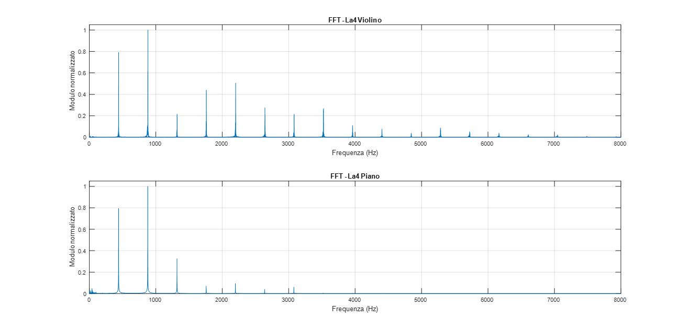
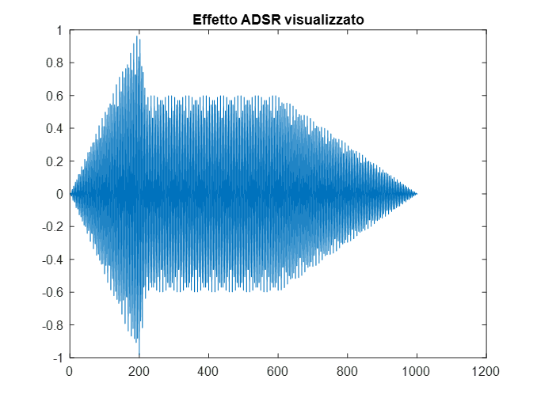
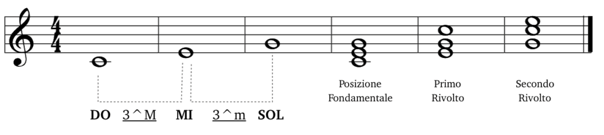
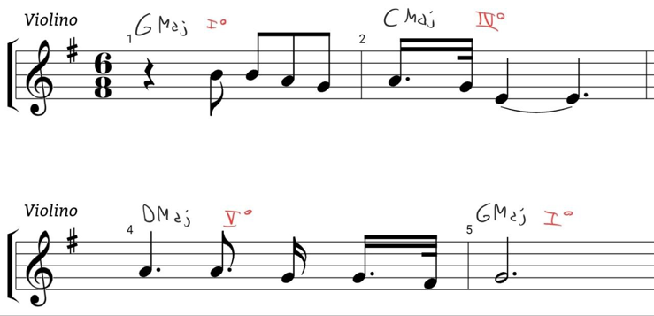

# Brief introduction of the content of this README
I'll just report the content of the ppt presentation in English

# Content
## What is a sound and how is it represented?
- Physically, a sound is caused by a pressure variation; it is, therefore, a true wave.
- A sound can be pure—consisting of a single sinusoidal wave—or complex, consisting of multiple sinusoidal components. The sinusoidal component with the lowest frequency is called the fundamental, while the others are known as partials. Furthermore, these partials are referred to as harmonics if they are integer multiples of the fundamental.
- Based on the fundamental frequency, we can define a formula to uniquely determine any note: denoting the frequency of 440 Hz (A) as the reference $f_{ref}, the frequencies of other notes can be calculated as follows: $f = 2^{\sigma - 4} \cdot 2^{\frac{N}{12}} \cdot f_{ref}$
- "σ" represents the reference octave, while "N" represents the note name (ranging from A to G#).

## The idea of the program
- The program aims to enable the performance of a "solo" melody with chord accompaniment.
- Once the melody (where the "tempo" variable represents the duration of a quarter note in seconds) and the chord progression are defined, the goal is to allow for maximum customization by enabling the user to select and modify various musical design parameters between performances.
- The "melody" vector specifies the notes to be played and their durations, while the "chords" vector contains the root notes for each chord.
- It is worth noting that—due to a design choice discussed later—the reference octave for both the melody and the accompaniment is specified globally at the outset, rather than for each individual note.

## The function for creating a sound
- The function receives the following parameters: sampling rate, duration, note identifier index, octave, and sound type.
- Due to the specific arrangement of notes in this melody, notes falling outside the A–B range are shifted to the lower octave; a more generic program would require specifying the octave for each note in the melody on a case-by-case basis.
- The time axis is defined based on the duration, and sound generation proceeds using the desired type selected from the five available options.
- Once created, the sound is normalized to standardize its amplitude.

## Complex and simple sounds
- As can be seen, the last two are complex, involving the contribution of multiple harmonics.
- The last two were created by analyzing the FFTs of two audio samples—specifically, the A4 notes from a piano and a violin.

## ADSR
- The ADSR (Attack, Decay, Sustain, Release) effect is an envelope used to shape a sound's amplitude over time, making it sound more natural.
- Attack is the time taken to reach maximum volume; Decay is the drop to the Sustain level—which remains constant while the note is held—and Release is the time it takes for the sound to fade out after the note is released.
- This function takes as input the sampling rate, the sound itself, its total duration, the attack, decay, and release times (and, consequently, the sustain time indirectly) as percentages, and finally the relative amplitude of the sound during the sustain phase.
- After converting the relative times into actual time values, it creates the envelope vector "E" and then multiplies it by (thereby applying it to) the original sound.
- The use of `round()` functions is not strictly necessary in the provided code example, but it can prevent potentially intrusive warnings from appearing in the terminal.
- 

## The function for creating the melody
- This function identifies the code and duration for each pair representing a note.
- If the note type is specified as NaN, it is interpreted as a rest with the indicated duration; otherwise, the sound is generated using the specified parameters, which apply to all notes in the melody.
- A different ADSR effect is applied depending on whether or not the note duration reaches that of a quarter note.
- After the sound is generated, it is concatenated to the melody, which is then saved in the variable "melodiaAudio".

 ## From the creation of the chord...
- In a major triad, in addition to the root note, there are two other tones located 4 and 7 semitones away, respectively (a major third and a perfect fifth).
- After defining these fixed intervals in an "intervals" vector, I calculate the codes for the notes that will make up the chord and store them in a new "degrees" vector.
- All that remains is to generate the sound for each note and add it to the chord.
- The use of a "shared" octave is also beneficial here: this approach ensures that the chords take on an inversion that prevents them from straying too far from one another, thereby lending a sense of continuity to the accompaniment.

## ...to the synthesis of the accompaniment
- Working through the "chords" vector—which, as previously noted, simply presents the respective root notes—we generate the corresponding chord for each one and then apply the ADSR effect.
- Once synthesized, each individual chord is concatenated with the accompaniment.

## And so there's music
- Due to potential rounding or artistic choices, the lengths of the accompaniment and the melody might differ.
- To sum them, it will be necessary to apply zero-padding to the shorter vector.
- Finally, save the sum of the two contributions into the "output" vector and (perhaps) enjoy the result!

